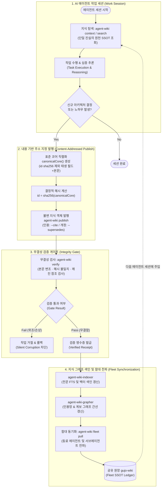
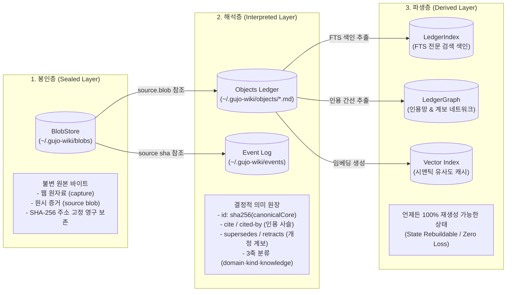

# Agent Wiki Mono

> **AI 에이전트 함대(Fleet)를 위한 Content-Addressed 불변 지식 원장 및 분산 메모리 SSOT 플랫폼**

`agent-wiki-mono`는 다수의 자율 AI 코딩 에이전트가 단일 진실의 원천(SSOT, Single Source of Truth)을 공유하고, 영구적 기억을 축적하며, 지식의 위변조와 손실 없이 협동할 수 있도록 설계된 분산 지식 원장 생태계입니다.

---

## 1. Why Agent Wiki? (문제 정의: AI 에이전트 기억의 3대 위기)

현대의 LLM 및 AI 코딩 에이전트는 뛰어난 추론 능력을 지녔지만, 협업과 장기 프로젝트 운영에서 세 가지 근본적인 벽에 직면합니다.

```
       [ 에이전트 세션 종료 ] ───▶ 컨텍스트 리셋 (기억 상실 발생)
                                        │
                                        ▼
       [ 일반 마크다운 파일 저장 ] ───▶ 동시 수정 충돌 & 덮어쓰기 파손
                                        │
                                        ▼
       [ 출처 불명의 환각 지식 ] ───▶ 전체 함대(Fleet)로 오염 전파
```

### 1) Context Amnesia (세션 간 기억 상실)
- AI 에이전트의 세션이 종료되면 메모리 내의 모든 아키텍처 결정, 트러블슈팅 경험, 디버깅 노하우가 완전히 증발합니다.
- 새로운 세션이 시작될 때마다 동일한 버그를 반복 분석하고, 이전 세션이 내린 결정을 번복하는 비효율이 발생합니다.

### 2) Flat Markdown 기록의 붕괴 (동시성 충돌 & 파일 파손)
- 단순 마크다운(`.md`) 파일에 지식을 남길 경우, 여러 에이전트가 동시에 작업할 때 **임의 덮어쓰기(Overwrite Damage)**와 **버전 불일치**가 일어납니다.
- 지식이 수정될 때 이전 결정과의 관계나 변경 사유가 추적되지 않아, 프로젝트가 진행될수록 문서 자체가 환각의 원천이 됩니다.

### 3) Silent Corruption & 출처 실종 (침묵하는 데이터 오염)
- 특정 결론이 "어떤 근거와 원자료(Source Blob)에서 도출되었는지" 입증할 수 없습니다.
- 잘못된 가정이나 폐기된 룰이 검증 없이 남아 시스템 전체에 가짜 지식을 전염시킵니다.

---

## 2. 핵심 솔루션: 불변 원장 & 검증 기반 지식 생태계

Agent Wiki는 지식을 단순 텍스트 파일이 아니라 **블록체인과 Git 수준의 무결성을 보장하는 분산 원장(Ledger)**으로 관리합니다.

| 비교 항목 | 일반 마크다운/위키 | Agent Wiki 원장 시스템 |
|---|---|---|
| **저장 방식** | 파일명 기반 수정 가능 파일 (`path/doc.md`) | 내용 기반 주소 지정 (**Content-Addressed SHA-256**) |
| **무결성 검증** | 없음 (임의 변조 및 삭제 감지 불가) | 발행 즉시 해시 일치 검증 (**`agent-wiki verify`**) |
| **개정 모델** | 덮어쓰기 (In-place Overwrite) | 불변 추가 사슬 (**`supersedes` / `retracts`**) |
| **출처 추적** | 작성자의 수동 텍스트 언급 | 인용 그래프 & 원본 해시 간선 (**Citation Ledger & BFS Path**) |
| **다중 에이전트** | Race Condition 및 충돌 빈발 | 분산 함대 동기화 & 영수증 검증 (**Fleet Pull & Receipts**) |

---

## 3. 비즈니스 로직 & 아키텍처 시각화

### 3.1 에이전트 지식 탐색-발행-검증-함대 동기화 수명주기

에이전트가 세션을 시작하여 지식을 소비하고, 새로운 결정을 검증된 원장으로 승격시켜 함대 전체에 공유하기까지의 파이프라인입니다.



### 3.2 원장 저장 3층 구조 (Storage Tri-Layer Architecture)

Agent Wiki의 원장은 데이터의 성격과 수명주기에 따라 엄격하게 3개 층으로 분리되어 동작합니다.



- **봉인층 (Sealed Layer)**: 외부에서 수집된 HTML, PDF, 원본 로그 파일 등 원시 데이터를 바이트 그대로 봉인하여 영구 보존합니다.
- **해석층 (Interpreted Layer)**: AI 에이전트의 사고, 판단, 규칙을 마크다운 객체로 기록합니다. 이전 지식을 수정할 때는 덮어쓰지 않고 `supersedes`로 개정 사슬을 잇거나 `retracts`로 철회합니다.
- **파생층 (Derived Layer)**: 해석층을 기반으로 구축된 검색 인덱스 및 그래프 구조입니다. 인덱스가 깨지더라도 봉인층과 해석층으로부터 언제든 100% 무손실 재구축(`rebuild`)이 가능합니다.

---

## 4. 모노레포 구성 (Monorepo Ecosystem)

### 4.1 Applications (`apps/`)

| 앱 디렉터리 | 역할 및 책임 | 표면 (Interfaces) |
|---|---|---|
| **`agent-wiki-synchronizer`** | 글로벌 원장 동기화 엔진 및 핵심 CLI(`agent-wiki`) 제공 | MenuBar GUI + full CLI |
| **`agent-wiki-reader`** | 위키 원장 탐색, 온보딩, 문서 조회 전용 뷰어 | Reader GUI + CLI |
| **`agent-wiki-editor`** | 지식 문서 작성, 메타데이터 입력, 마크다운 편집기 | Editor GUI |
| **`agent-wiki-indexer`** | SQLite FTS 및 벡터 색인 관리, 고속 키워드 검색 엔진 | Indexer CLI / Core |
| **`agent-wiki-grapher`** | 인용 관계망(Citation) 및 개정 계보 시각화 엔진 | Graph GUI / CLI |

### 4.2 Shared Swift Kits (Root)

| 패키지 | 역할 및 아키텍처 책임 |
|---|---|
| **`agent-wiki-kit`** | **KnowledgeBaseWikiCore**, **WikiCLIShared**, **BlobStoreKit**을 포함하는 위키 엔진 SSOT |
| **`citationledgerkit`** | Content-Addressed 해시 주소 계산(`CitationLedgerObject`), ms 단위 정밀 타임스탬프, UUIDv7 세션 식별 |
| **`swiftkit`** | `CommandKit`(안전 프로세스 실행), `InteropKit`, `StateMirrorKit`(4면 계약) 등 공통 프레임워크 |
| **`swiftkit-appscaffold`** | macOS 네이티브 앱 라이프사이클 및 메뉴바 앱 스캐폴딩 |
| **`swiftkit-sparkle`** | 인앱 자동 업데이트 및 배포 지원 |

---

## 5. 핵심 CLI 워크플로우

`agent-wiki`는 에이전트 런타임에서 직접 호출 가능한 풍부한 CLI 인터페이스를 제공합니다.

### 1) 지식 조회 & 컨텍스트 주입
```bash
# 질문에 관련된 컨텍스트 원장 조회 (세션 시작 시 필수)
agent-wiki --world gujo-wiki context "앱 배포 및 ship 절차 규칙"

# 키워드 검색
agent-wiki --world gujo-wiki search "Twin-Lock"

# 특정 객체 본문 조회
agent-wiki --world gujo-wiki show 8f274a2a
```

### 2) 인용 추적 & 출처 역추적 (Provenance Tracking)
```bash
# 두 결론 사이의 인용 경로를 BFS로 추적 ("이 규칙이 어떤 원자료에서 왔는가?")
agent-wiki path a1b2c3d4 e5f6g7h8

# 특정 객체를 인용하고 있는 모든 후속 객체 탐색
agent-wiki cited-by 8f274a2a

# 객체의 개정 이력 사슬 확인 (supersedes 계보)
agent-wiki history 8f274a2a
```

### 3) 지식 발행 & 무결성 검증 (Publish & Verify)
```bash
# 신규 지식 객체 발행 (stdin 본문 주입)
echo "배포 시 Twin-Lock 동시성 규칙을 적용한다." | agent-wiki publish \
  --title "배포 동시성 락 규율" \
  --domain "devops" --kind "rule" --knowledge "tech" \
  --classification-reason "빌드 충돌 방지를 위한 잠금" \
  --cite 8f274a2a

# 원장 무결성 전수 검사 (변조·참조 손상·해시 불일치 감지)
agent-wiki verify
```

### 4) 다중 세계관(World) 격리 및 승격
```bash
# 세계관 목록 조회 (공유 gujo-wiki / 개인 person-yun-jeonghan / 레포 .wiki)
agent-wiki world list

# 로컬 저장소 지식을 중앙 공유 원장으로 프로모션 (양방향 불변 영수증 발행)
agent-wiki promotion preview 4be6e774 --to gujo --json
agent-wiki promotion publish 4be6e774 --to gujo --confirm --json
```

---

## 6. 빌드 및 테스트

모든 컴포넌트는 Swift Package Manager(SPM)를 기반으로 독립적이고 엄격하게 검증됩니다.

```bash
# 코어 킷 테스트
swift test --package-path agent-wiki-kit
swift test --package-path citationledgerkit

# 동기화기 및 agent-wiki CLI 빌드
swift build --package-path apps/agent-wiki-synchronizer --product agent-wiki

# GUI 앱 빌드
swift build --package-path apps/agent-wiki-reader
swift build --package-path apps/agent-wiki-grapher
```

---

## 7. 라이선스

MIT License
